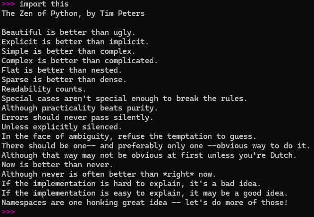

Irei compartilhar meus estudos aqui, pois é ensinando que se aprende!

#  Meus Estudos em Python
---

## 📘 O que é Python?
- Não, não é a cobra, apesar de que a logo tem duas cobras juntas se você ainda não percebeu rs. 
- Python é uma linguagem de programação de alto nível, simples de aprender e muito usada no mundo todo.  
- Ela é conhecida por ter uma sintaxe clara e parecida com o inglês, o que ajuda bastante iniciantes.

---

## 💻 Instalação do Python
O Windows não vem com o Python integrado (ao contrário do Linux e MacOS, que já costumam trazer versões instaladas).  
Então, para usar Python no Windows, você precisa baixar e instalar manualmente.

- 🔗 Site oficial: [https://www.python.org/downloads/](https://www.python.org/downloads/)  
- Depois da instalação, é importante marcar a opção **"Add Python to PATH"** para conseguir rodar no terminal.  

Para verificar se deu certo, abra o **Prompt de Comando** e digite:

```bash
python --version
```
---

## ☯️ Zen do Python
- O Zen do Python é tipo um conjunto de conselhos para quem programa em Python.
- Não são regras obrigatórias, mas sim uma “filosofia” para deixar o código mais bonito, fácil de entender e organizado.
> Sabe quando na escola você via aquelas frases de filosofia, tipo
“A simplicidade é o último grau de sofisticação.” (Quem falou isso foi Sócrates, não eu rs).
O Zen do Python segue essa ideia: não são regras rígidas, mas uma filosofia que incentiva clareza e simplicidade no código.

Para ver no prompt de comando (terminal) do seu sistema operacional (Win, Linux, MacOS) basta digitar:

```python
import this
```



---

## 📏 PEP-8 — Guia de Boas Práticas em Python

O PEP-8 é como se fosse um manual de etiqueta do Python.
Ele não muda o jeito que o programa funciona, mas ajuda a deixar o código bonito, limpo e fácil de entender (pra você e pra qualquer outra pessoa que for ler seu código).

> 🚦 É como dirigir no trânsito.
Você pode até parar o carro atravessado, estacionar em qualquer canto ou não usar seta.
O carro anda do mesmo jeito.
Mas se todo mundo segue as regras de trânsito, o caminho fica mais organizado, seguro e fácil pra todo mundo.

> O PEP-8 é isso no Python: não obriga você a programar daquele jeito, mas se você segue, o código fica organizado e qualquer pessoa consegue entender. 🐍

## 📝 3 regras principais para começar

Indentação e Espaçamento
- Use 4 espaços por nível de indentação (nunca tab).
- Deixe linhas em branco para separar funções, classes e blocos lógicos.

```python
# ❌ Errado: usando TAB ou número de espaços diferente
def soma(a, b):
  resultado = a + b   # só 2 espaços
   return resultado   # 3 espaços, confuso
```

```python
# ✅ Certo: sempre 4 espaços
def soma(a, b):
    resultado = a + b
    return resultado
```
Nomes Claros e Padrão de Nomenclatura
- Variáveis e funções: snake_case → minha_variavel, calcular_total().
- Classes: CamelCase → MinhaClasse.
- Constantes: UPPER_CASE → TAXA_FIXA.

```python
# ❌ Errado: nomes confusos e fora do padrão
def CALC(a, b):
    x = a * b
    return x
```

```python
# ✅ Certo: nomes descritivos e no estilo correto
def calcular_total(preco_unitario, quantidade):
    TAXA_FIXA = 5  # constante em maiúsculas
    total = preco_unitario * quantidade + TAXA_FIXA
    return total
```
Comprimento das Linhas
- Limite cada linha de código a no máximo 79 caracteres (ou 72 em docstrings).

```python
# ❌ Errado: linha muito longa (difícil de ler)
mensagem = "Este texto é muito longo e ultrapassa o limite de caracteres recomendados pelo PEP 8, dificultando a leitura."
```

```python
# ✅ Certo: dividir linha longa
mensagem = (
    "Este texto é longo, mas foi quebrado "
    "em várias partes para facilitar a leitura."
)
```
📚 Quer aprender mais sobre o PEP-8?
Confira o guia oficial: [PEP-8 — Style Guide for Python Code](https://peps.python.org/pep-0008/)


